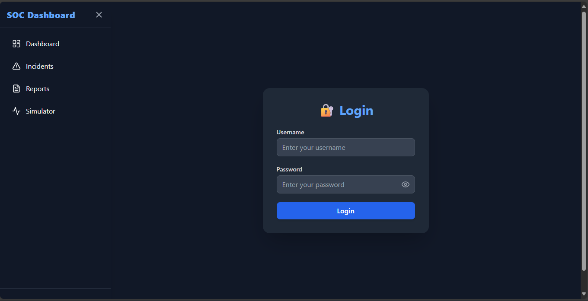
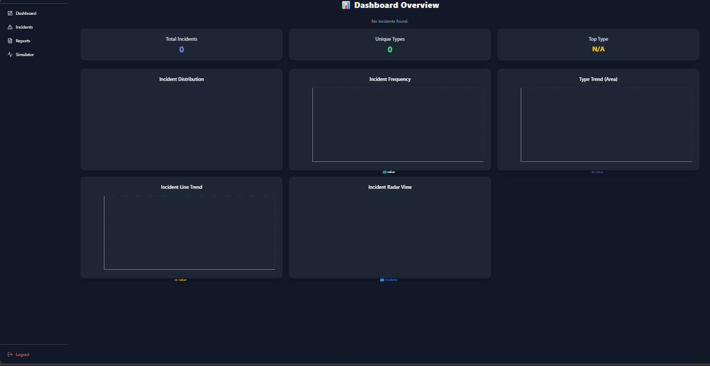
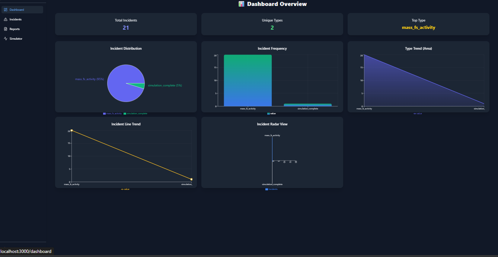
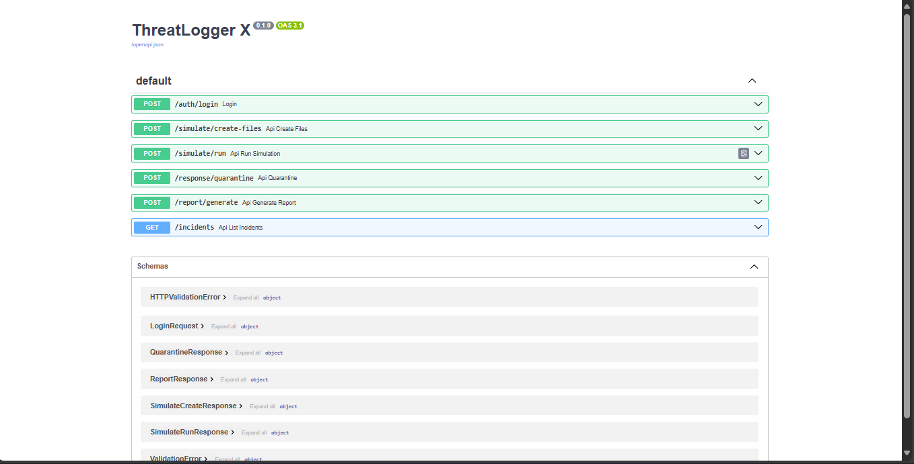
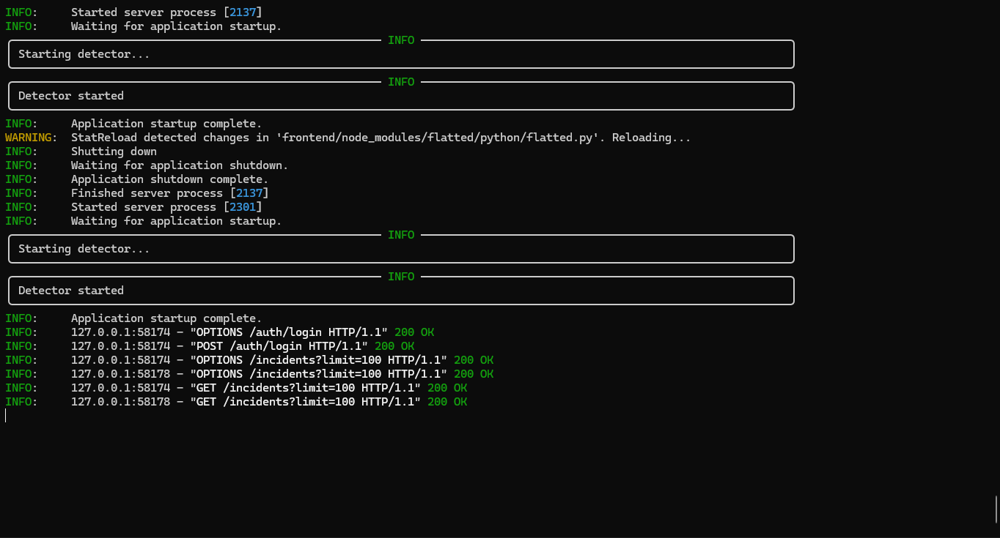
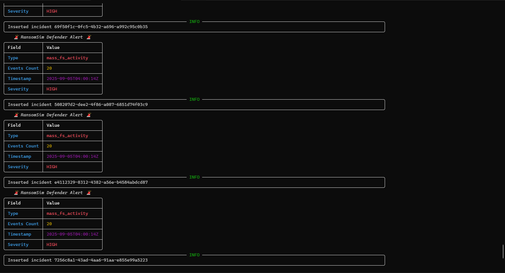

# ⚡ ThreatLogger X

<p align="center">
  <b>Full-Stack Security Logging & Monitoring Tool</b>
  <br>
  Built with <b>FastAPI (Backend)</b> + <b>React (Frontend)</b>
</p>

---


---

## 📑 Table of Contents
- [About](#-about)
- [Features](#-features)
- [Project Structure](#-project-structure)
- [Installation & Setup](#️-installation--setup)
- [Default Credentials](#-default-login-credentials)
- [Screenshots](#-screenshots)
- [Tech Stack](#-tech-stack)
- [Future Improvements](#-future-improvements)
- [Contributing](#-contributing)
- [License](#-license)
- [Contact](#-contact)
- [Note](#-note)

---

## 📖 About

🚀 **ThreatLogger X** is a modern full-stack project designed to make **threat logging and monitoring** simple, secure, and efficient.
With a clean UI and powerful backend, it helps in recording suspicious activities and visualizing logs in real-time.

---

## 🚀 Features
- 🔐 Secure Login System (with default credentials)
- ⚡ High-performance **FastAPI backend**
- 🎨 Responsive **React frontend**
- 📊 Real-time monitoring dashboard
- 📝 Log history tracking
- 🖼️ Preview screenshots included

---

## 📂 Project Structure
```
ThreatLogger-X/
 ├── backend/       # FastAPI backend
 ├── frontend/      # React frontend
 ├── screenshot/    # Project screenshots
 └── README.md
```

---

## 🛠️ Installation & Setup

### 🔹 1. Backend (FastAPI)
```bash
cd backend
python -m venv venv
source venv/bin/activate   # Linux/Mac
venv\Scripts\activate      # Windows

pip install -r requirements.txt
uvicorn backend.app.main:app --reload
```
👉 Runs at: [http://127.0.0.1:8000](http://127.0.0.1:8000)

---

### 🔹 2. Frontend (React)
```bash
cd frontend
rm -rf node_modules package-lock.json
npm install
npm install react-scripts@5.0.1
npm start
```
👉 Runs at: [http://localhost:3000](http://localhost:3000)

---

## 🔑 Default Login Credentials
Use these credentials to log in:

- **Username:** `admin`
- **Password:** `admin123`

---

## 📸 Screenshots

### 🔹 Frontend
<p align="center">
  
  
  
</p>

### 🔹 Backend
<p align="center">
  
  
  
</p>

---

## 📌 Tech Stack


---

## 🔮 Future Improvements
- Add role-based authentication
- Integration with external log storage (MongoDB/ElasticSearch)
- Export logs as CSV/JSON
- Dark mode UI
- Add user activity analytics dashboard

---

## 🤝 Contributing
Contributions, issues, and feature requests are welcome!
1. Fork the repo
2. Create a new branch (`feature-xyz`)
3. Commit your changes (`git commit -m 'Add some Feature'`)
4. Push to the branch (`git push origin feature-xyz`)
5. Open a Pull Request

> 💡 Don’t forget to give the project a ⭐ if you like it!

---

## 📄 License
Distributed under the **MIT License**.
See `LICENSE` for more details.

---

## 📧 Contact
👤 **Author:** [Prasad Sarkate](https://github.com/Prasadsarkate)
📬 Feedbacks, suggestions, and contributions are always welcome!

---

## 📝 Note
> ⚠️ **Disclaimer:** This project is for **learning and development purposes only**.
> Not recommended for production use without proper security improvements.
